# Agents 调研分享 Wiki

> 面向内部产品与技术团队。原始材料：2026 年 9 月《Agents 调研》及其 25 张配图。CLI 补充依据 ModelScope 官方资料，于 2026-09-23 核对。

一个 Agent 从开发者手中的代码或配置，到成为其他人能够发现、复用和使用的能力，需要不同平台共同承接。本文先区分资产与消费方式，再观察 Space、AgentHub 和企业工作台的产品路径，最后讨论建设边界与优先级。

## 目录

- [1. 基础概念：资产与消费](#concepts)
- [2. Space：应用运行与体验](#space)
- [3. AgentHub：资产管理与复用](#agenthub)
- [4. 企业工作台：业务中的 Agent 消费](#workspace)
- [5. 三类平台的职责对照](#comparison)
- [6. 建设建议与下一步](#next)
- [7. 资料与配套文件](#references)

<a id="concepts"></a>
## 1. 基础概念：资产与消费

### 1.1 Agent 以什么形式存在

Agent 的主要资产载体可以是代码工程、工作流 / DSL、声明式定义，也可以是封装后的分发包。这些形态可以组合。Skill、工具、MCP 服务、Prompt 和知识资源属于组成能力；实例状态、部署镜像和服务描述则对应运行或交付环节。

**资产平台首先需要明确管理对象：逻辑定义、依赖资源、分发包与运行状态各自如何标识和版本化。**

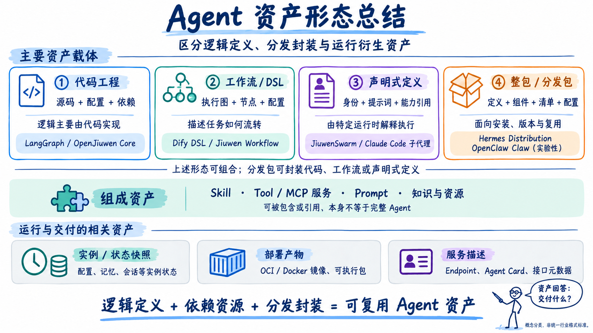

### 1.2 Agent 如何被消费

资产形态与消费方式是两个独立维度。一个 Agent 可以通过 SDK、API 或其他协议接入，作为独立 Agent、子代理或工作流节点参与任务，再通过 Web、IDE、桌面应用或企业工作台触达用户。

讨论消费方案时，需要分别回答：**如何接入、以什么角色参与、用户在哪里使用，以及任务如何触发和返回。**

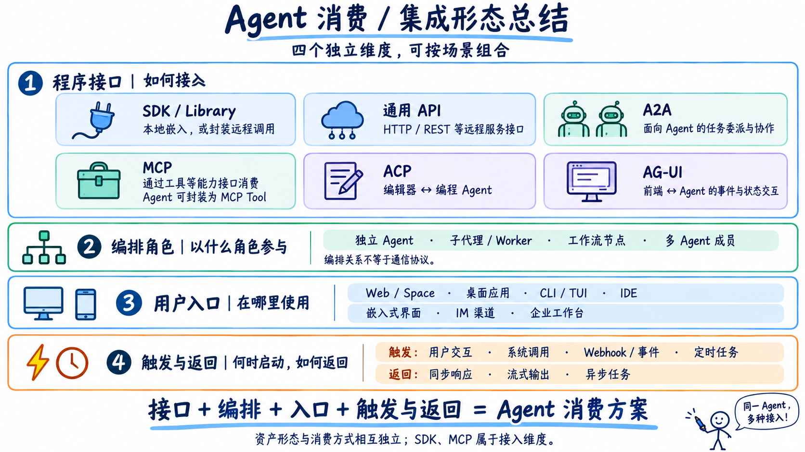

### 1.3 三类平台在生命周期中的位置

- **Space**：把工程部署为可访问、可体验的应用。
- **AgentHub**：组织 Agent 的定义与相关资源，支持管理和复用。
- **企业工作台**：让员工在任务中发现和调用 Agent，连接企业数据与系统。

下图表达平台间的概念关系，不表示示例产品已经实现了图中所有跨平台链路。后文按照“可见的应用体验、可复用的资产、企业内的实际使用”展开。

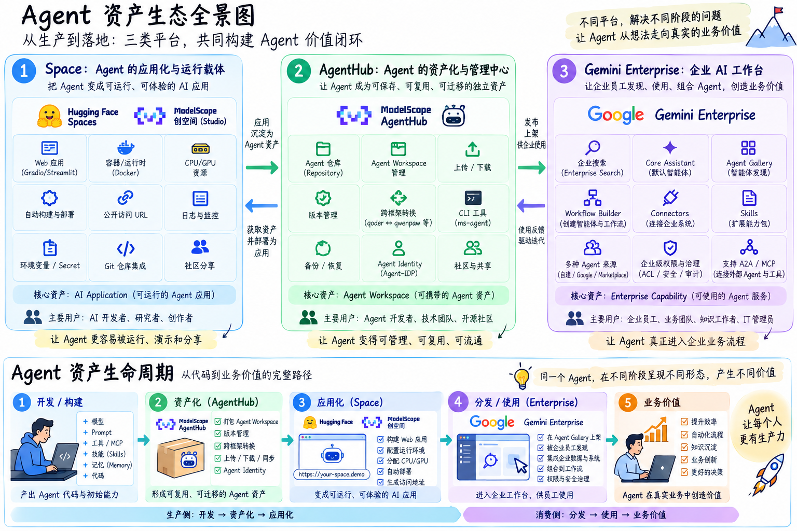

<a id="space"></a>
## 2. Space：应用运行与体验

### 2.1 产品定位

Space 的重点是应用化：开发者提交工程，选择应用框架和运行环境，平台完成构建部署，提供用户可访问的入口。材料选取 Hugging Face Spaces 与 ModelScope 创空间作为案例。Space 可以承载多种 AI 应用，并非所有应用都属于 Agent。

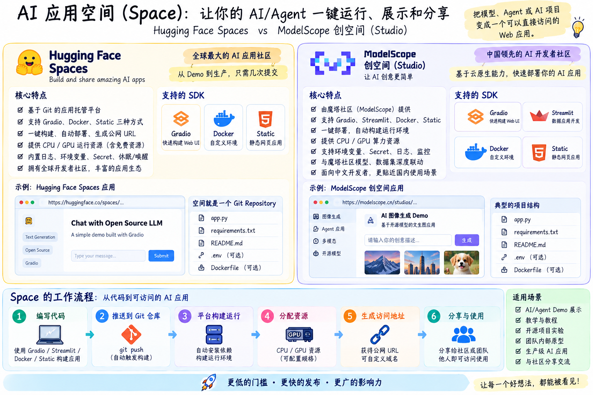

### 2.2 应用发现

应用广场通过场景、封面和示例帮助用户选择体验对象。用户首先关心应用能做什么、能否直接使用；开发者则需要借助广场展示和分享应用。

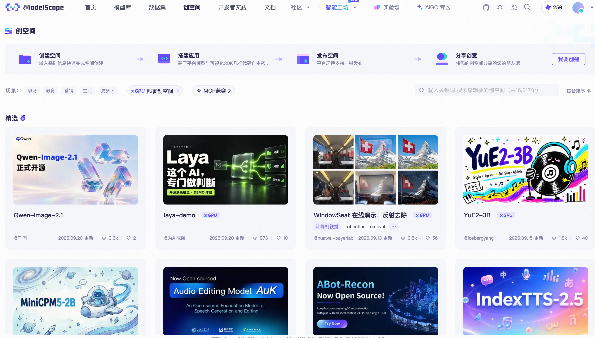

### 2.3 创建与部署流程

**第一步：提交空间文件。** 上传工程内容，作为后续构建的输入。这里交付的不只是能力介绍，还包括实际应用所需的文件。

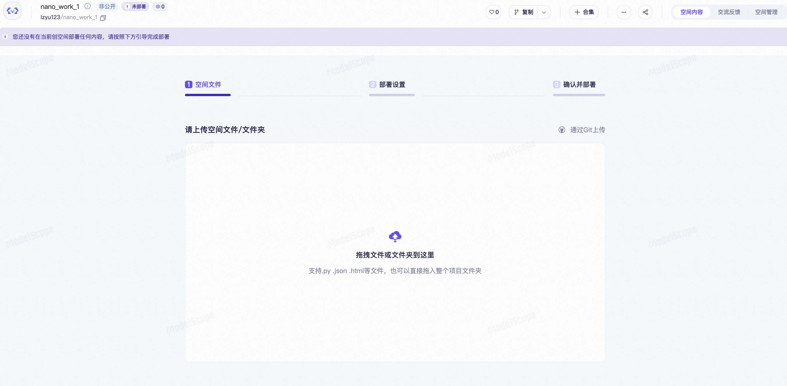

**第二步：选择部署设置。** 截图展示了 Gradio、Streamlit、Static、Docker 等选项，以及计算资源和环境配置。应用运行依赖这些条件共同就绪。

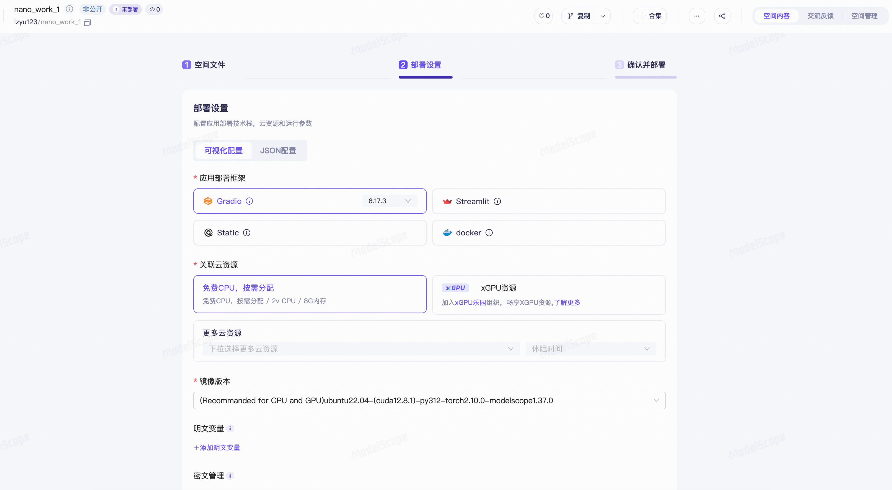

**第三步：确认并部署。** 将工程文件与运行参数汇总核对。产品流程上，应当区分“文件已提交”和“应用已成功运行”两个状态。

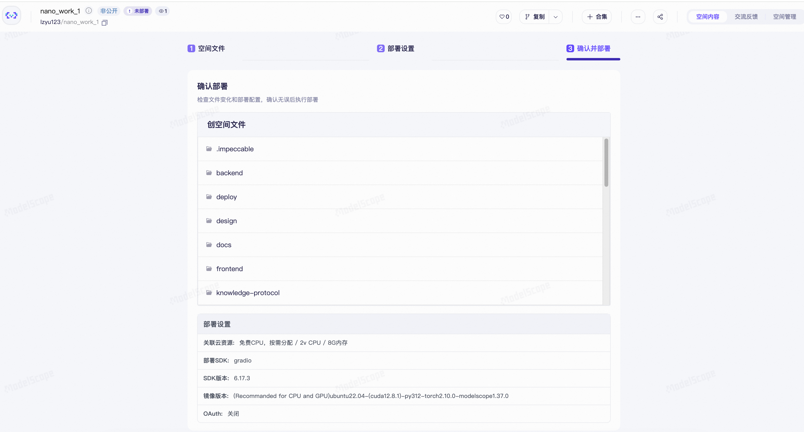

### 2.4 运行后的用户体验

WindowSeat 示例以图片上传和示例素材组织操作。平台提供访问入口，应用本身负责具体任务的交互。

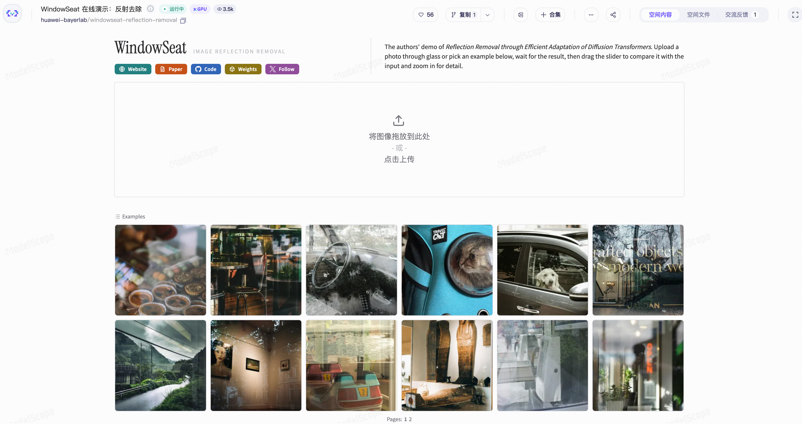

Hugging Face Spaces 的 Qwen 图像应用同样以输入区和操作界面呈现能力。两者共同体现：Space 将工程、运行条件和用户交互组合成可访问的应用。

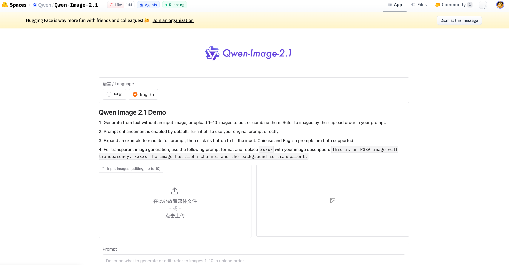

**小结：** Space 解决“如何跑起来并让人体验”。当我们进一步关心资产版本、依赖和跨环境复用时，就需要 AgentHub 这一层。

<a id="agenthub"></a>
## 3. AgentHub：资产管理与复用

### 3.1 产品定位

AgentHub 面向 Agent 的资产化管理，围绕仓库、文件组织、版本、发布和获取形成产品能力。这里的 **Agent Workspace 指 Agent 文件与资源的组织方式**，区别于第 4 章面向员工的企业工作台。

下图保留原始调研概览。其中 CLI 命令属于示意，实际命令层级和能力边界见本章 3.5 节。

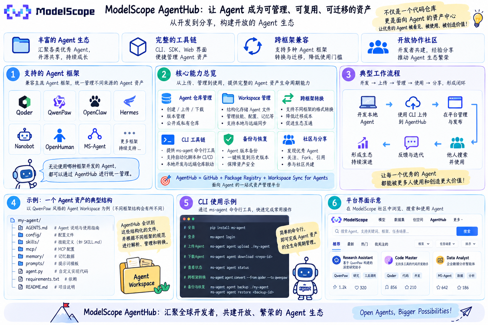

### 3.2 发现与获取 Agent

首页的 Agent 卡片同时呈现场景、所属框架、Skill 和 MCP 等信息，帮助开发者判断是否适合自己的使用环境。

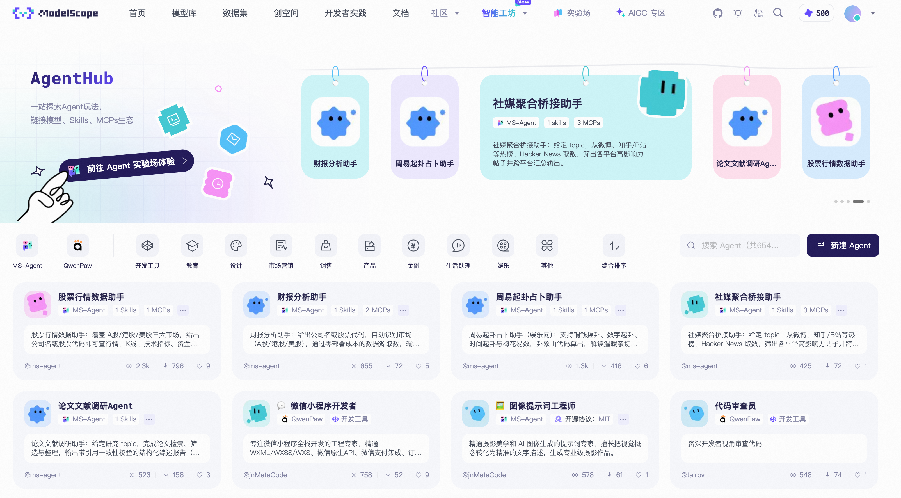

详情页进一步展示名称、描述、框架、标签、许可证等声明信息，并提供获取入口。它连接了“了解能力”和“拿到资产”两个动作。

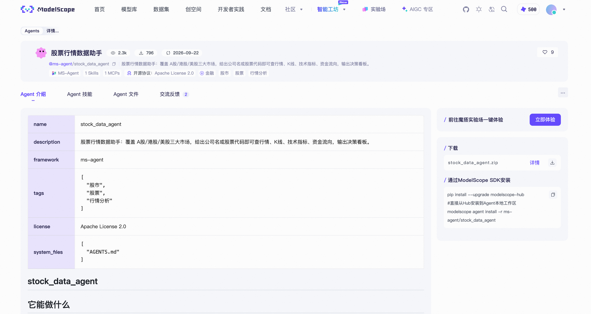

### 3.3 组成能力与实际文件

Skill 与 MCP 信息单独展示，有助于用户识别依赖。声明中列出某项依赖，与当前环境已经完成安装和授权，仍是不同状态。

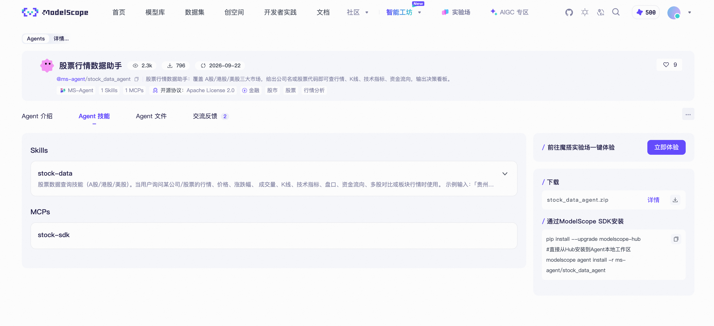

文件视图展示 AGENTS.md、README.md、mcp.json、skills.json 等内容，让能力描述能够对应实际交付文件。不同框架可以有不同结构，资产平台需要识别这些差异。

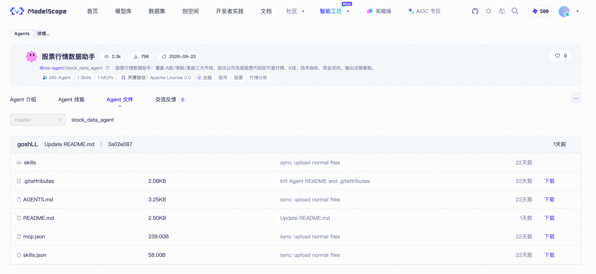

### 3.4 创建与发布路径

新建入口同时提供界面创建和 CLI 上传，分别适合配置型创建与本地工程发布。两种路径可以共享资产声明和校验规则。

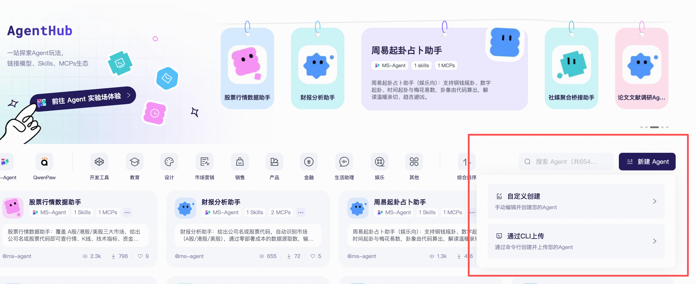

创建表单显式组织框架、系统设定、模型、Skill 和 MCP，体现平台对 Agent 组成结构的理解。

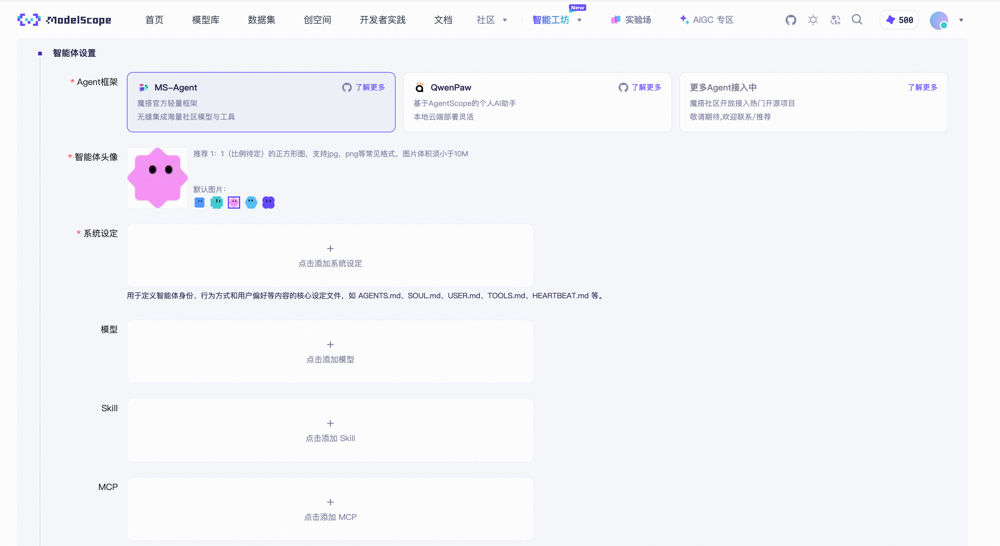

### 3.5 补充：ModelScope AgentHub 的 CLI 能力

#### 两组命令的分工

| 命令入口 | 主要职责 | 使用场景 |
| --- | --- | --- |
| `ms-hub agent` | Agent 仓库原始文件的上传、下载和列表查询；通过插件处理安装 | 保留原始文件结构，或使用安装入口 |
| `ms-agent agent` | 按框架组织 Workspace，执行转换、同步及恢复等操作 | 在本地框架与远端资产仓库之间复用 Agent |

`ms-hub` 与 `modelscope-hub` 是同一 CLI 的两个入口。其 `download` / `upload` / `list` 不做框架转换；`install` 将处理交给插件，最终是安装到框架还是仅获取文件，取决于插件能力。[官方 ModelScope Hub 文档](https://github.com/modelscope/modelscope_hub#ms-hub-agent)

#### Workspace 管理能力速览

以下子命令均接在 `ms-agent agent` 后面：

| 子命令 | 能力 |
| --- | --- |
| `upload` / `download` | 上传、下载指定框架的 Agent 文件 |
| `list` | 分页查看远端仓库，可按所有者筛选 |
| `watch` | 后台推送本地变更，增加 `--pull` 后双向同步 |
| `status` | 查看本地 Agent 状态 |
| `convert` | 离线转换 Workspace 文件，写入前备份已有目标 |
| `backups` / `restore` | 列出备份、从备份恢复 |
| `stop` | 停止后台同步 |

常用参数：`-f` 指定框架，`-r` 指定 `owner/name` 仓库，`--local-dir` 指定 Workspace 根目录。`upload`、`download`、`convert` 提供 `--dry-run` 预览。[官方 CLI 参考](https://github.com/modelscope/ms-agent/blob/main/docs/en/GetStarted/CLI.md#agent--agent-hub-file-management)

官方列出的框架包括 `qoder`、`qwenpaw`、`openclaw`、`hermes`、`nanobot`、`openhuman` 和 `ms-agent`。这里的转换对象是 Workspace 文件与可迁移资源；不能据此推断任意框架的执行逻辑都能无损转换。[官方 MS-Agent 项目说明](https://github.com/modelscope/ms-agent)

#### 常用命令示例

以下是供读者参考的命令，本文未执行上传、安装或同步。`your-account/demo-agent` 为仓库占位符，`./agent-workspace` 为本地 Workspace 示例路径；使用前按实际框架与目录替换。

```bash
# 确认本机版本暴露的命令与参数
ms-agent agent --help
ms-hub agent --help

# 预览要上传的文件；新建仓库采用私有可见性
ms-agent agent upload -f qwenpaw -r your-account/demo-agent   --local-dir ./agent-workspace --visibility private --dry-run

# 预览跨框架转换，不写入目标目录
ms-agent agent convert --from-framework qoder --target-framework qwenpaw   --local-dir ./qoder-workspace --out-dir ./qwenpaw-workspace --dry-run

# 查看本地 Workspace 状态
ms-agent agent status -f qwenpaw --local-dir ./agent-workspace

# 仅下载仓库原始文件
ms-hub agent download -r your-account/demo-agent --local-dir ./agent-files
```

前述 `--dry-run` 示例仅预览，确认内容后移除该参数才会写入或上传。网络操作需要相应权限与凭据。具体参数依据[MS-Agent CLI 参考](https://github.com/modelscope/ms-agent/blob/main/docs/en/GetStarted/CLI.md#agent--agent-hub-file-management)及[Hub CLI 说明](https://github.com/modelscope/modelscope_hub#ms-hub-agent)。

**与原图的差异：** Workspace 管理命令需要 `ms-agent agent` 这一层级。`backups` 是查看备份列表，不应把原图的 `ms-agent backup` 当成已核实的手动备份命令。原图用于能力概览，操作时以本机 `--help` 和对应版本文档为准。

### 3.6 对产品建设的启示

AgentHub 的价值在于把描述、组成能力和交付文件对应起来，并让界面与 CLI 共享资产管理规则。对我们而言，需要优先定义资产标识、版本和依赖，再验证资产进入目标框架或运行平台的完整路径。

资产获取之后，企业员工如何真正使用这些能力，是下一层工作台要解决的问题。

<a id="workspace"></a>
## 4. 企业工作台：业务中的 Agent 消费

### 4.1 产品定位

材料以 Gemini Enterprise 为例，归纳了搜索、默认助手、Agent Gallery、技能、工作流、连接器和治理等能力。企业工作台关注的是员工任务：能否找到合适的能力、访问所需数据，并在组织权限范围内完成工作。

本章界面描述以原始截图为依据；全景图中的完整能力范围属于调研归纳，不视为逐项实测结论。

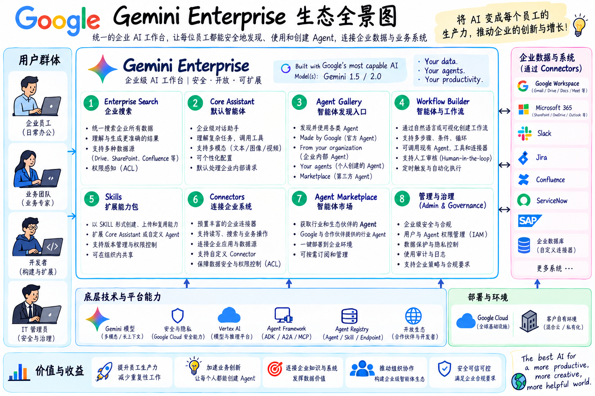

### 4.2 统一任务入口

员工从对话中选择 Agent 或技能，将能力放在正在处理的任务上下文中。与资产下载相比，这一入口更强调直接使用。

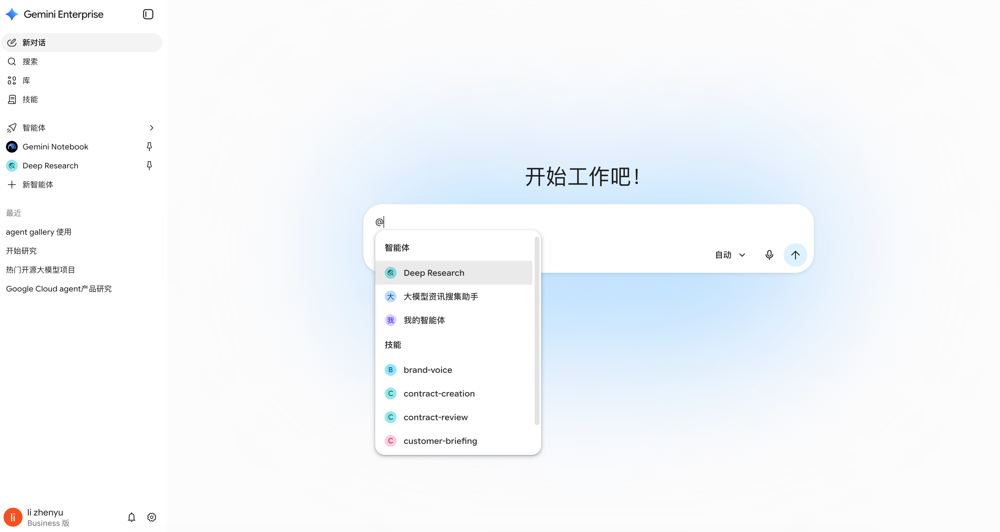

### 4.3 技能与规则沉淀

`brand-voice` 示例展示了品牌表达规则。企业可复用的内容不仅包括检索文档，也包括执行任务时需要遵循的规则；这些规则需要维护、共享并关联到实际使用入口。

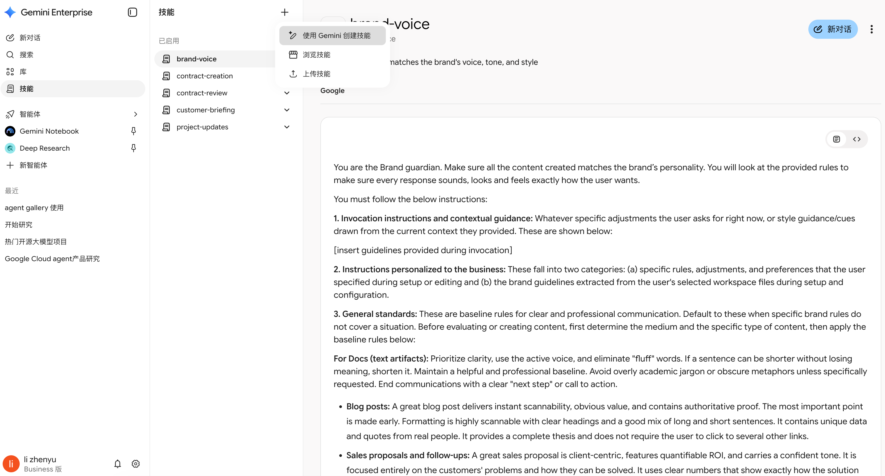

### 4.4 Agent 发现与创建

Gallery 按来源组织官方与个人智能体。原截图标注了 Gallery 与 Marketplace 开通的调研观察，适用于当时的使用环境，不宜直接推广到所有租户。

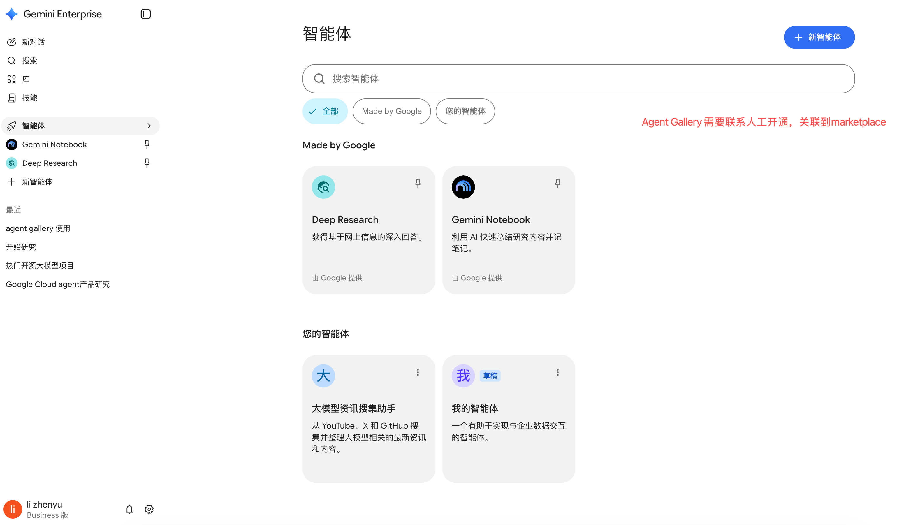

创建入口提供自然语言描述和手动配置两种方式。降低创建门槛之后，还需要让创建者能够验证效果并明确发布范围。

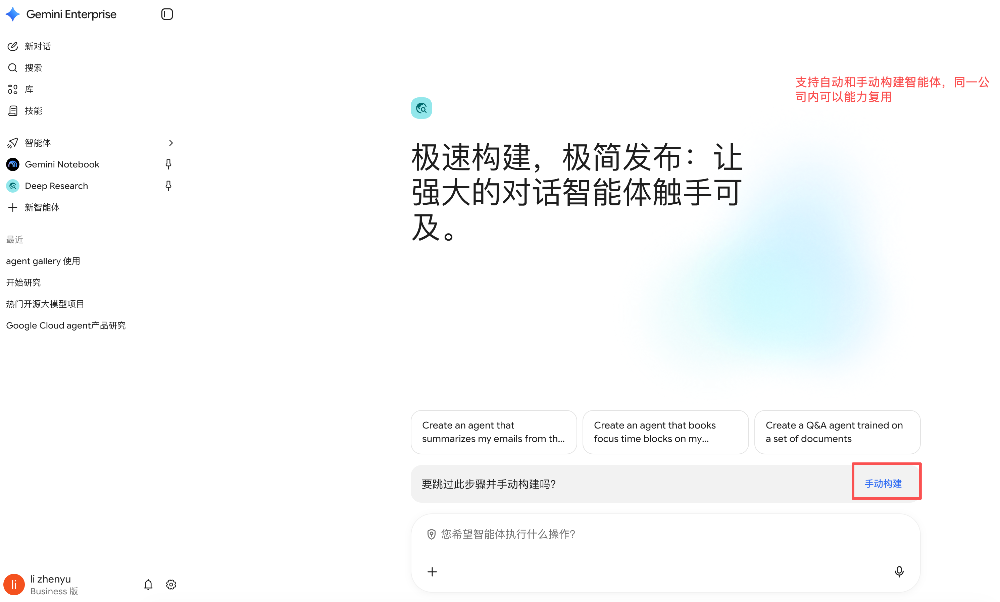

### 4.5 企业系统连接

连接器页面体现了数据与业务系统的接入入口。Agent 能做什么，既取决于自身定义，也取决于连接状态和授权范围。

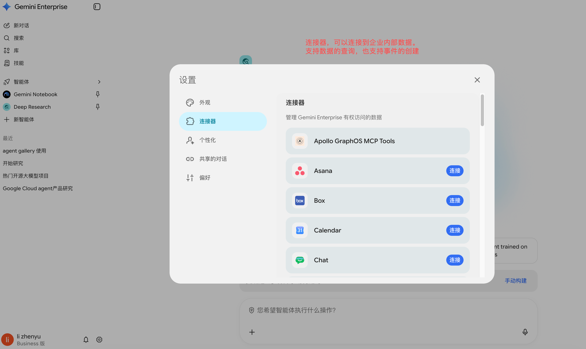

### 4.6 外部能力分发

Marketplace 提供外部能力的发现与分发。公共市场、组织内可用目录和员工实际入口各有职责，需要在授权、部署和使用环节衔接。

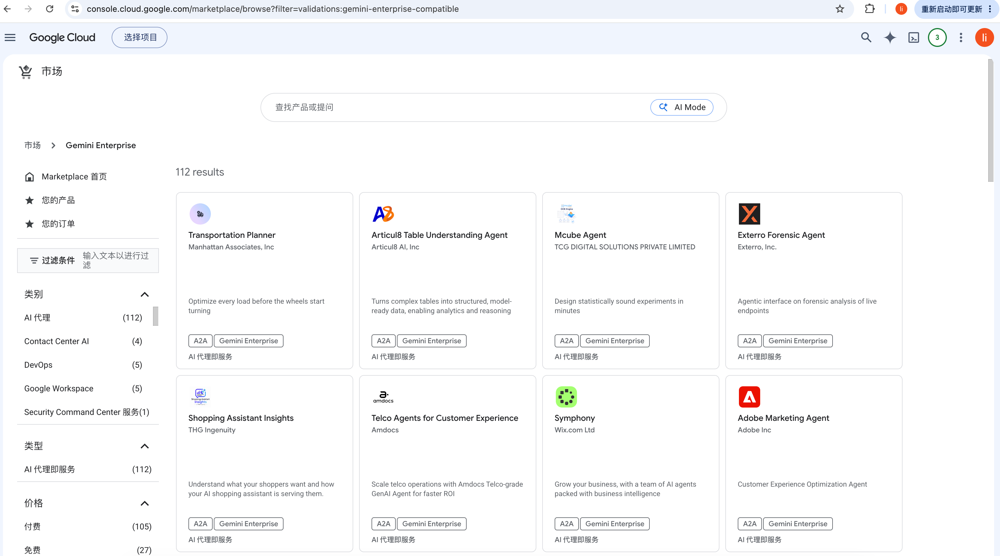

<a id="comparison"></a>
## 5. 三类平台的职责对照

下表是基于材料的产品归纳，用于讨论职责边界。

| 维度 | Space | AgentHub | 企业工作台 |
| --- | --- | --- | --- |
| 核心对象 | 可运行的应用 | 可复用的资产 | 可使用的业务能力 |
| 主要用户 | 应用开发者、体验者 | Agent 开发者、技术团队 | 企业员工、业务团队 |
| 典型动作 | 构建、部署、展示 | 发布、版本管理、获取 | 发现、调用、连接系统 |
| 建设重点 | 运行环境与应用体验 | 标准、依赖与资产流转 | 任务入口与权限治理 |

三类平台可以共享身份、资产元数据与权限基础，同时保持各自的产品职责。需要重点打通的是**资产发布到运行，再到企业使用**的链路。

<a id="next"></a>
## 6. 建设建议与下一步

### 6.1 生态方案

原材料提出了覆盖开源开发、资产管理、运行、应用展示、企业消费和商业分发的建设方案。以下内容属于**待评审的规划建议**，不表示现有产品已经具备图中全部能力。

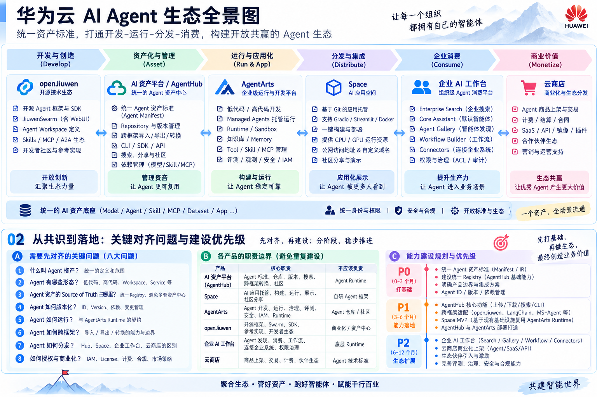

### 6.2 建议的职责划分

| 产品或平台 | 建议重点职责 |
| --- | --- |
| openJiuwen | 开源框架、参考实现与开发者生态 |
| AI 资产平台 / AgentHub | 统一资产声明、仓库、版本、搜索与依赖 |
| AgentArts | Agent 开发、托管运行、评测与治理 |
| Space | 应用构建、部署、访问与展示 |
| 企业 AI 工作台 | 企业内的发现、任务执行、系统连接与权限管理 |
| 云商店 | 商品上架、交易、计费与生态分发 |

### 6.3 分阶段建设

| 阶段 | 原材料建议窗口 | 优先事项 |
| --- | --- | --- |
| P0：资产基础 | 0–3 个月 | 统一 Manifest / Registry，明确 ID、版本、依赖和产品边界 |
| P1：能力衔接 | 3–6 个月 | 完成上传、下载、搜索和 CLI，验证框架适配及部署链路 |
| P2：企业与生态 | 6–12 个月 | 扩展企业工作台和市场分发，完善治理与伙伴接入 |

时间窗沿用原材料建议，需要结合人员和产品现状确认。

### 6.4 下一轮讨论的具体产出

1. **统一资产定义与权威来源**：明确 Registry 管哪些对象、谁维护版本、如何关联依赖。
2. **确认产品边界与负责人**：划清资产管理、运行托管、应用展示、企业消费和交易职责。
3. **选择首个验证场景**：用一个 Agent 验证创建、发布、获取、部署与企业使用的完整链路，再决定扩大建设范围。

<a id="references"></a>
## 7. 资料与配套文件

- 原始材料：《Agents 调研.md》，全部 25 张原图按原始内容保留。
- [配套 PPT](Agents调研_内部分享.pptx)
- [逐页演讲稿](Agents调研_演讲稿.md)
- [ModelScope Hub 官方 SDK / CLI](https://github.com/modelscope/modelscope_hub)
- [MS-Agent 官方项目](https://github.com/modelscope/ms-agent)
- [MS-Agent CLI 参考](https://github.com/modelscope/ms-agent/blob/main/docs/en/GetStarted/CLI.md)

图片保存在同目录的 `Agents调研_分享Wiki.assets/` 中，使用标准 Markdown 相对路径引用。分享或迁移时，请将本文与图片文件夹一起复制。
